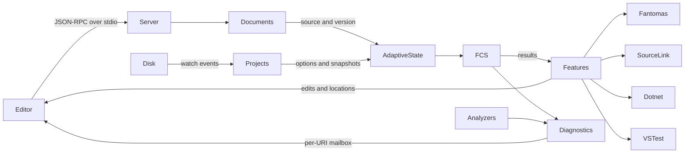

# FsAutoComplete reliability system model

Date: 2026-09-23.

## Requested scope

> Research FsAutoComplete repository-wide and produce a prioritized reliability property catalog with source evidence, existing test evidence, and suitable test methods.

Research covers the repository's major subsystems, integration boundaries, test infrastructure, and build/runtime constraints.
Execution scope is read-only source inspection and environment inventory. No build, restore, test, benchmark, mutation, or fault experiment ran.

- Source revision: `85886b187b87834e0fe0a410cb13332d7f9757ca`.
- Source checkout: isolated fresh checkout at the pinned revision.
- Source dirty state: clean before and after inspection.
- Skill: `dotnet-reliability-research`, revision `0e4e2df532eaff581ac2d931a45bcf3f1294a770`.
- Skill source: [SKILL.md](../../../../dotnet-reliability-research/SKILL.md). The revision identifies the applied instructions.
- Output location follows the explicit evaluation assignment.
- Prior evaluation reports were not read or used as evidence.

## Runtime and dependencies

The inspected SDK selection was .NET SDK 10.0.401, MSBuild 18.9.11, host runtime 10.0.12, Windows 10.0.26200, win-x64.
[global.json](https://github.com/ionide/FsAutoComplete/blob/85886b187b87834e0fe0a410cb13332d7f9757ca/global.json) requests 8.0.300 with latestMajor roll-forward and prerelease allowed.
The observed SDK follows that policy. It does not prove the project builds with every selected SDK.

The server, Core, LSP tests, and benchmarks target net8.0, net9.0, and net10.0.
Logging, OptionAnalyzer, and the separate TestExplorer runner target net8.0.
The dummy dependency manager targets netstandard2.0. The GoToCSharp fixture also targets netstandard2.0.
These project declarations take precedence over stale framework descriptions in AGENTS.md.

[paket.lock](https://github.com/ionide/FsAutoComplete/blob/85886b187b87834e0fe0a410cb13332d7f9757ca/paket.lock) pins FSharp.Compiler.Service 43.12.201, FSharp.Core 10.1.201, Ionide.ProjInfo 0.75, Expecto 10.2.3, and Fantomas.Client 0.12.0-beta-002.
[.config/dotnet-tools.json](https://github.com/ionide/FsAutoComplete/blob/85886b187b87834e0fe0a410cb13332d7f9757ca/.config/dotnet-tools.json) pins Paket 10.3.1 and Fantomas 7.0.5.
No explicit repository-wide LangVersion was found in the inspected project/build files.
F# language defaults therefore depend on the build compiler. Script options can select a different language version.
No compiler binary was executed to establish its effective language version.

[Directory.Build.props](https://github.com/ionide/FsAutoComplete/blob/85886b187b87834e0fe0a410cb13332d7f9757ca/Directory.Build.props), [Directory.Build.targets](https://github.com/ionide/FsAutoComplete/blob/85886b187b87834e0fe0a410cb13332d7f9757ca/Directory.Build.targets), [src/Directory.Build.props](https://github.com/ionide/FsAutoComplete/blob/85886b187b87834e0fe0a410cb13332d7f9757ca/src/Directory.Build.props), and [Directory.Solution.targets](https://github.com/ionide/FsAutoComplete/blob/85886b187b87834e0fe0a410cb13332d7f9757ca/Directory.Solution.targets) control warnings, graph-based checking, analyzer flags, and formatting targets.
Projects import Paket restore targets. Fixture restores occur during LSP test project builds.
Builds and tests can therefore need network access and write fixture outputs.

## Projects and entry points

[FsAutoComplete.sln](https://github.com/ionide/FsAutoComplete/blob/85886b187b87834e0fe0a410cb13332d7f9757ca/FsAutoComplete.sln) contains eight top-level projects.

| Project | Role and entry point |
| --- | --- |
| FsAutoComplete | Executable. Program.entry calls Parser.invoke, then exits. Parser selects loader/compiler options and starts the adaptive server. |
| FsAutoComplete.Core | FCS wrapper, source text, filesystem shim, compiler caches, symbol analysis, generation, external tools, and test adapters. |
| FsAutoComplete.Logging | Logging providers and Activity helpers. |
| FsAutoComplete.Tests.Lsp | Expecto entry point, in-process LSP fixtures, compiler/loader matrix, and four optional shards. |
| FsAutoComplete.Tests.TestExplorer | Separate Expecto executable with real VSTest sample projects. |
| OptionAnalyzer | Test analyzer assembly loaded into the server process. |
| FsAutoComplete.DependencyManager.Dummy | FCS dependency manager fixture. It returns empty successful resolution. |
| benchmarks | BenchmarkDotNet entry point and source-text workloads. |

A file inventory found 44 .fsproj/.csproj files, including the eight top-level projects and 36 fixture projects.
Fixture projects provide sample language programs, cross-project references, test adapters, and C# navigation.
They are not 36 separately deployed services.

## State and transitions

Open document records own in-memory source and versions. Adaptive maps retain pending changes and project dependencies.
FCS owns parse/check state. FSAC adds a bounded cache of weak references for selected check results.
A process-global FCS filesystem shim reads open buffers before physical files.
[src/FsAutoComplete/LspServers/AdaptiveServerState.fs:1443-1455](https://github.com/ionide/FsAutoComplete/blob/85886b187b87834e0fe0a410cb13332d7f9757ca/src/FsAutoComplete/LspServers/AdaptiveServerState.fs#L1443-L1455) installs that shim.
Multiple servers inside one process therefore require special test isolation.

Each diagnostic URI has a mailbox and a cancellation source.
Each diagnostic kind retains its own version watermark.
A send failure replaces the agent with empty state. This is recovery of processing, not durable message recovery.

Shared adaptive tasks use locks, mutable reference counts, cached Task values, and cancellation sources.
The system also uses F# Async, cancellableTask, TaskCompletionSource, ConcurrentDictionary, and SemaphoreSlim.
No evidence supports deterministic control of all these operations by a concurrency framework.

Save causes current-file checking, dependent-file checking, and dependent-project checking.
Close removes open state and cancels file work. Diagnostic retention depends on workspace/project membership.
Configuration changes affect compiler construction, script options, analyzers, and feature behavior.
These cross-subsystem transitions are cataloged separately from pure transformations.

## Persistence and security boundaries

There is no application database or replicated consensus service in the inspected architecture.
Persistence consists of source/project files, package/SDK caches, downloaded SourceLink files, generated navigation files, and logs.
Project XML edits save directly to disk. SourceLink downloads use a temporary path and reuse files based on existence.
Neither mechanism establishes a transaction across files.

Client DTOs, PDB JSON, analyzer paths, SDK output, formatter responses, and test-adapter callbacks are input boundaries.
UMX tags distinguish path roles but do not enforce canonical paths or containment.
Discriminated unions preserve compiler mode and formatter result variants.
Raw positions, versions, paths, and deserialized strings still require runtime checks.

The editor and workspace are local trust inputs. Project evaluation and analyzers can execute code.
This catalog does not claim a sandbox for hostile repositories, analyzers, test binaries, or SDK tools.

## References

Repository evidence is pinned to the source revision. External protocol/tool references supply proposed test methods, not observed results.

- [LSP specification](https://microsoft.github.io/language-server-protocol/specifications/lsp/3.17/specification/)
- [FsCheck](https://fscheck.github.io/FsCheck/)
- [Hedgehog](https://hedgehogqa.github.io/fsharp-hedgehog/)
- [Coyote](https://microsoft.github.io/coyote/)
- [Testcontainers for .NET](https://dotnet.testcontainers.org/)
- [TimeProvider](https://learn.microsoft.com/dotnet/standard/datetime/timeprovider-overview)

No live external documentation or service behavior was verified.
